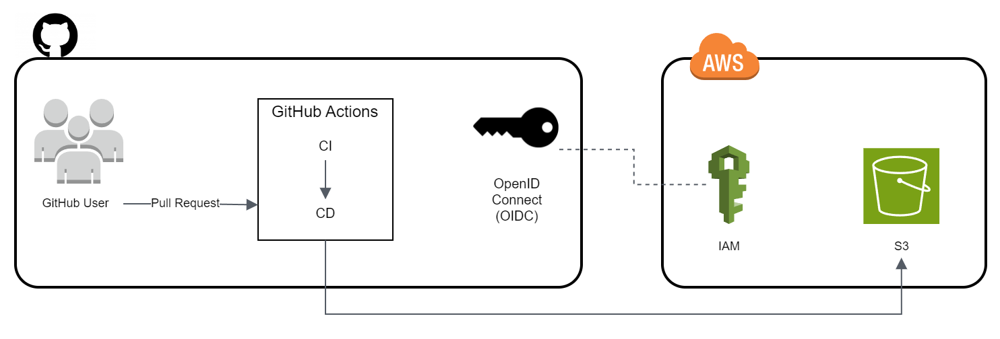

# Challenge Front-end Smart Fit


## About
Smart Fit's challenge is this small project created as a basis for the assessment of technical skills for the Front-end role.

## Challenge Proposal
Smart Fit, as it operates in the fitness segment, went through several changes in the pandemic. It was necessary to develop a page to search for closed or open units for consultation and reservation.

## Features
- Loads units via json `https://test-frontend-developer.s3.amazonaws.com/data/locations.json` file with method `GET`
- Search all units
- Search for units with filters
- Shows prediction of results found
- Shows units when searching
- CI with GitHub Actions
- App in production with AWS

## Technologies
- Visual Studio Code 1.87.0
- Node.js 20.11.0
- NPM 10.2.4
- Angular CLI 17.1.3

## AWS Architecture


## How to run local
Clone this repository
```bash
  git clone https://github.com/arthur-timoteo/challenge_front-end-code-challenge-smartsite.git
```

Access project folder
```bash
  cd challenge_front-end-code-challenge-smartsite/smartfit
```

Install dependencies
```bash
  npm install
```

Start application
```bash
  npm start
```

## Suggestion of extra deliveries
- Unit and e2e testing (test only the important thing)
- Travis CI
- App in production (Heroku, Vercel and etc...)
- Running with Docker locally

## License
This project is under the MIT license. See the [LICENSE](./LICENSE) file for more details.